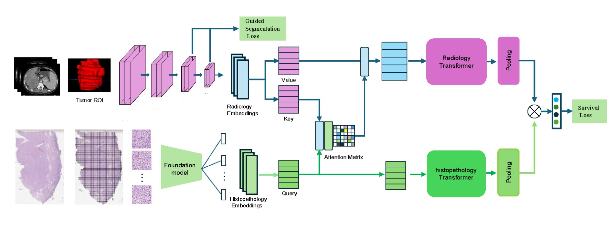

# RadHisFusion

The code for the paper "Deep learning radiopathomics signature to predict recurrence risk of hepatocellular carcinoma after hepatectomy" published in Communications Biology.

## The architecture of RadHisFusion

## Usage

python python main_rad_his_fusion.py

## Acknowledgements

Part of codes are reused from the [PORPOISE](https://github.com/mahmoodlab/PORPOISE). Thanks for the codes of PORPOISE.

